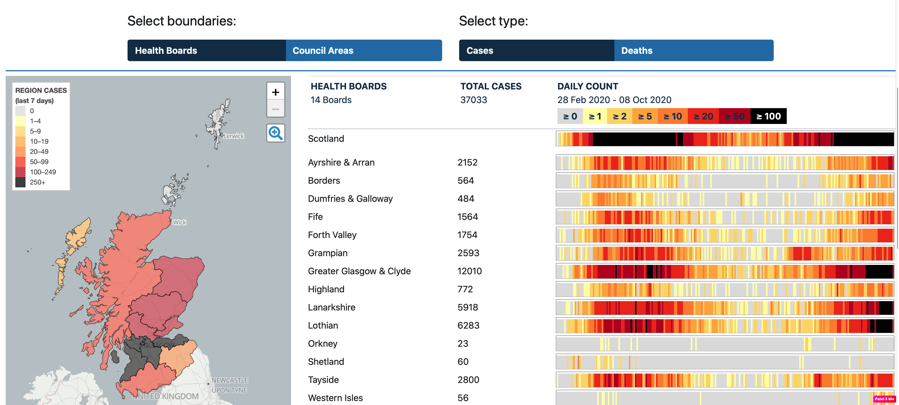
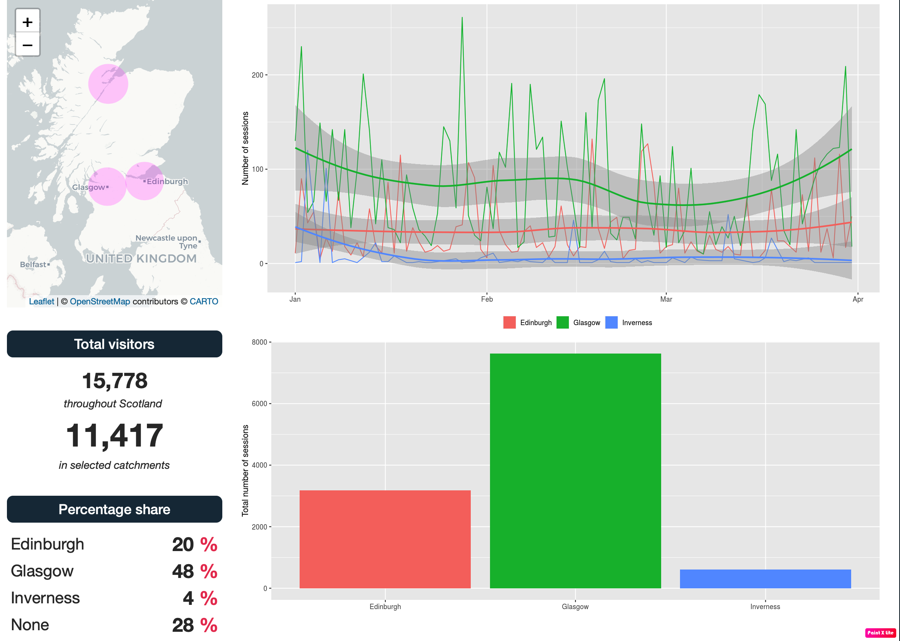
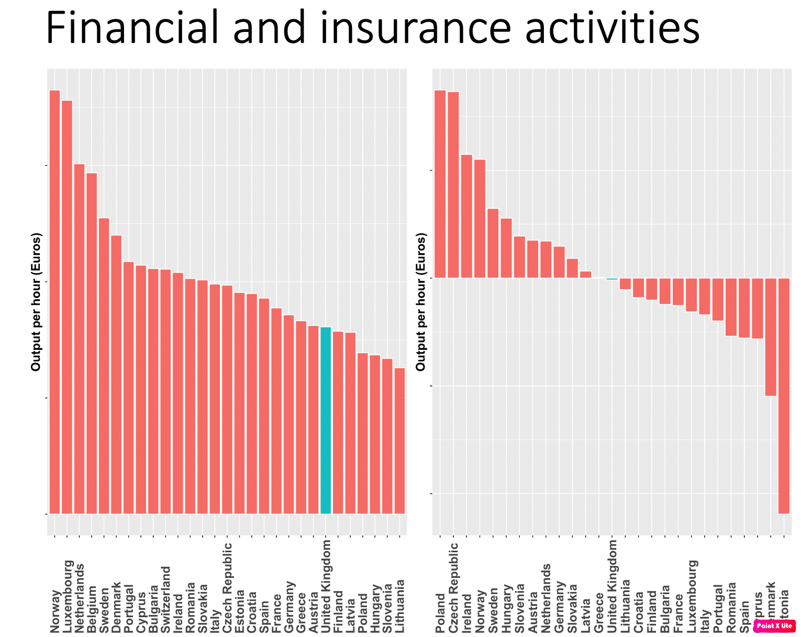
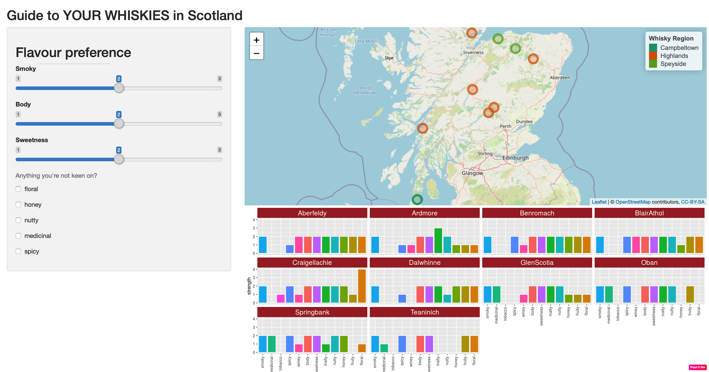
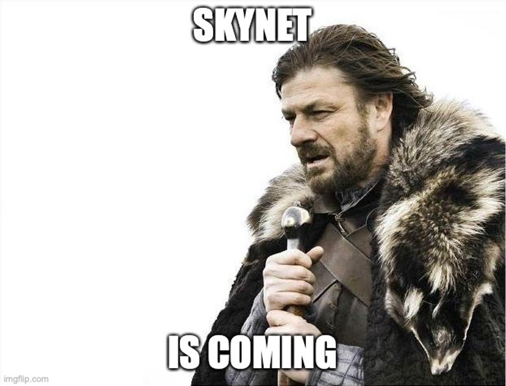

***  

# Introduction

Here are a few data analysis work examples.
  
****     
## Scottish Tech Army COVID-19 dashboard
  
***Current***  
[[Files]](https://github.com/Scottish-Tech-Army/STACovidDashboard)
&nbsp;
[[Dashboard]](https://covid19.scottishtecharmy.org)  
This is the current dashboard - an amalgamation of all three projects.  
  
  
  
>In June 2020, we set the members of the Scottish Tech Army a challenge - look at the published data on the Covid-19 pandemic and come up with a way of presenting it in an interactive accessible way that would make the data more available and more usable to people across Scotland - we called it our Homebrew Challenge. **[- STA announcement](https://www.scottishtecharmy.org/blog/covid-19-dashboard-for-scotland)**
  
  
  
  
***Original***  
[[Files]](https://github.com/ThisIsJohnnyLau/COVID-19_scottish_tech_army)
&nbsp;
[[Dashboard]](https://thisisjohnnylau.shinyapps.io/COVID-19_scottish_tech_army/)  
This was one of the three dashboards entered for the initial STA Homebrew challenge.  

**** 

## Business Intelligence Dashboard
[[Files]](https://github.com/ThisIsJohnnyLau/shiny_dashboard_project)&nbsp; [[Dashboard]](https://thisisjohnnylau.shinyapps.io/shiny_dashboard_project/)
  
Group project using Shiny to fulfil client brief through data analysis, business awareness and user-centered design  
  
  
  

**** 

## Deloitte Business Analysis Project
[[Files]](https://github.com/ThisIsJohnnyLau/deloitte_productivity_project)
  
CodeClan project focussing on client requirements, concept feasibility, presentation and consolidation of curriculum.
  
  >“Productivity is commonly defined as a ratio between the output volume and the volume of inputs. In other words, it measures how efficiently production inputs, such as labour and capital, are being used in an economy to produce a given level of output.” - OECD

    
  

**** 

### Whisky dashboard - find YOUR whisky
[[Files]](https://github.com/ThisIsJohnnyLau/whisky)
&nbsp;
[[Dashboard]](https://thisisjohnnylau.shinyapps.io/find_your_whisky/)  

A bit of fun - I'm a big whisky fan and want to help people pair their palette / mood with (perhaps) new distilleries - especially for those new to whisky!  
  
  
  

**** 

### Ethics presentation – code of conduct in the new ‘data economy’
[[Files]](https://github.com/ThisIsJohnnyLau/ethics_presentation)
&nbsp;
[[Presentation]](https://github.com/ThisIsJohnnyLau/ethics_presentation/raw/master/Code%20of%20Conduct%20Presentation.pptx)  

***Background***  

On 16th March 2020, I gave a data ethics presentation to Data Analysis classmates at CodeClan, Edinburgh.

***Introduction***  

Unlike lawyers, accountants, medics or actuaries, there is currently no requirement for data scientists to hold any specific qualification or industry membership. There is rising awareness of the harmful power of data, and a number voluntary codes of conduct have been developed.  
    
    
  
**** 

### Dirty Data Project
[[Files]](https://github.com/ThisIsJohnnyLau/dirty_data_project)  
  
***Why are good data cleaning skills important for analysis?***  
  
* Estimated $3 trillion US GDP lost in 2016 - IBM
* 1 in 3 business leaders did not trust the data sources used in decision-making

> _'Garbage in leads to garbage out'_

***You get to know your data***  

* Understanding data through inital cleaning and exploration
* Reduces the risk of incorrect assumptions
* Raises relevant questions
* Discovery of issues such as biases in data collection
* Opportunities to problem solve for unique datasets
* Setup to extract additional insight
* Setup to emphasis particular questions  
  
***Project files and analysis***

This project centres around cleaning six dirty datasets  

* Task 1 - Decathlon Events [[analysis]](task_1.html)
* Task 2 - Cake Ingredients [[analysis]](task_2.html)
* Task 3 - Seabirds Spottings [[analysis]](task_3.html)
* Task 4 - Sweeties Survey [[analysis]](task_4.html)
* Task 5 - Right Wing Authoritarianism [[analysis]](task_5.html)
* Task 6 - Dogs [[analysis]](task_6.html)
  
