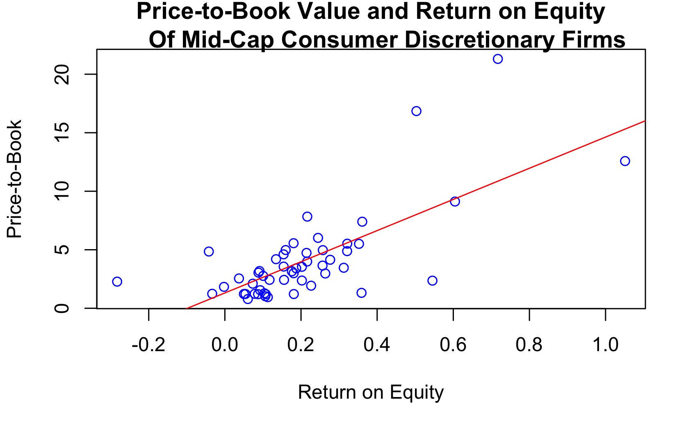
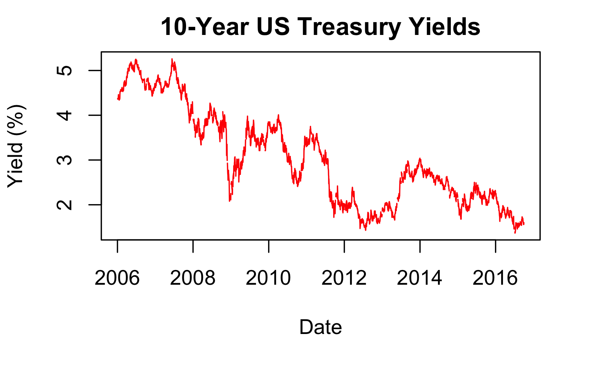

***  

# Introduction

Investment analysis without a spreadsheet in sight...  Click on hyperlinks or pics for coding examples. 
  
****  
# Security analysis

## Equity valuation
[[Code]](equity_valuation.html)

How do we know when a stock is cheap or expensive? To do this, we need to compare the stock's price with its value. Every investor has to form his or her own valuation.

  

To have a solid understanding of how the value of the equity compares to the stock price it is important to appreciate fundamental concepts of valuation such as *the time value of money*.  

## Bond valuation
[[Code]](bond_valuation.html)

Bonds are securities issued by governments or corporations that pay interest over a fixed schedule and are the most well-known type of fixed income securities. However, like most fixed income instruments, they can trade very infrequently.  

  
Consequently, a bond's price may be a less reliable indicator of its value and analytical techniques are necessary when analyzing and valuing bonds.  
